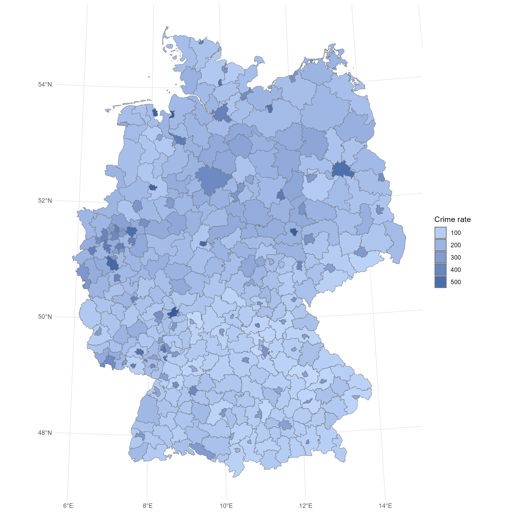
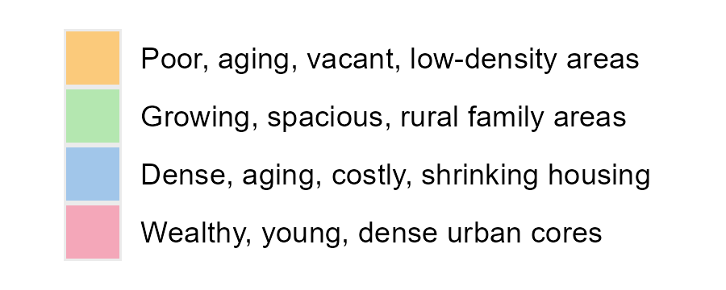
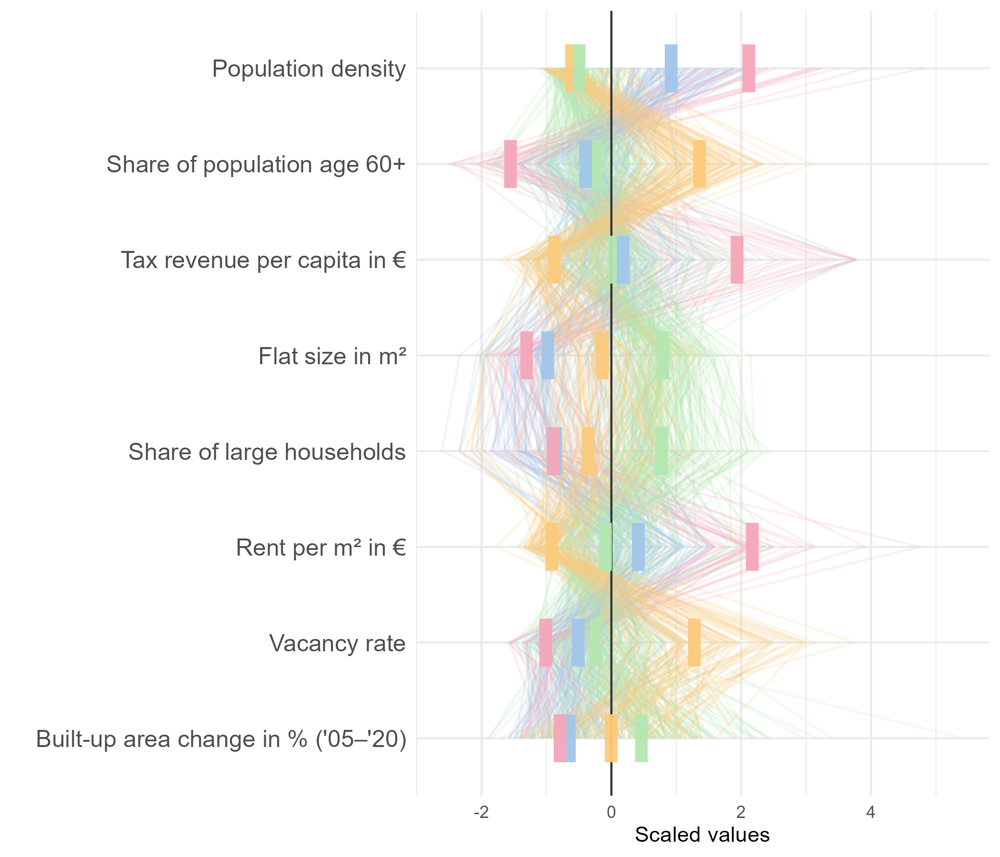

# Violent Crimes in Germany by Regions

This repository hold all replication material for a group project about geospatial characteristics on explaining and predicting violent crimes.

This project is part of the Hackathon [DataFest](https://www.stat.lmu.de/soda/en/latest-news/events-overview/event/datafest-germany-2025.html) 2025 at LMU Munich.

Authors:
Wai Tak Tung,
Leena Maaß,
Stefan Munnes

## Code structure

0. [install.R](scripts/install.R)
1. [plot_map_crimerate.R](scripts/plot_map_crimerate.R) ([load_data.R](scripts/load_data.R))
2. [create_data_pks_districts.R](scripts/create_data_pks_districts.R) ([load_data.R](scripts/load_data.R), [misc.R](scripts/misc.R))
3. [an_cluster_create.R](scripts/an_cluster_create.R) ([plot_corr_variables.R](scripts/plot_corr_variables.R), [misc.R](scripts/misc.R))
4. [an_cluster_plots.R](scripts/an_cluster_plots.R) ([load_data.R](scripts/load_data.R), [misc.R](scripts/misc.R))
5. [an_scatter_plot.R](scripts/an_scatter_plot.R)
6. [an_regression.R](scripts/an_regression.R)

## Crime rate (violence) in Germany

Source: [PKS 2022](https://www.bka.de/DE/AktuelleInformationen/StatistikenLagebilder/PolizeilicheKriminalstatistik/PKS2022/PKSTabellen/KreisFalltabellen/kreisfalltabellen.html?nn=211724)

## Regional clusters in Germany

## Scatter plot: Crime rate by 4 cluster variables 
